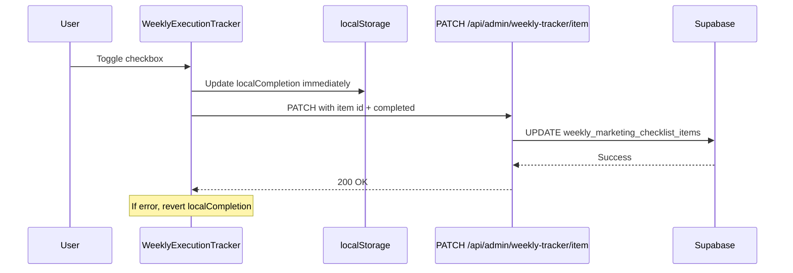
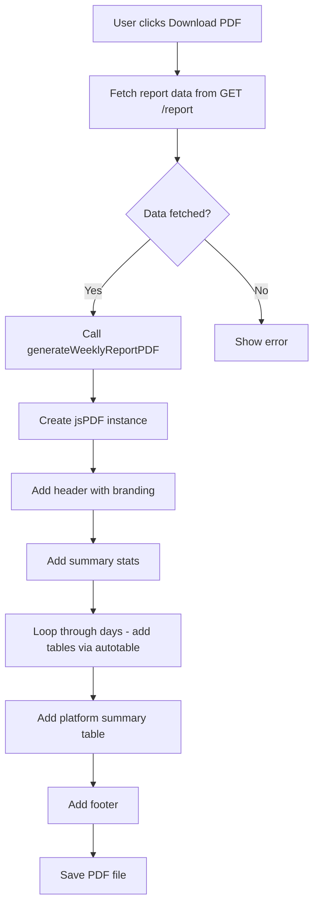
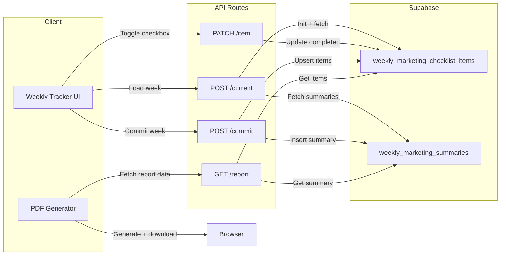

# Weekly Execution Tracker: Supabase Persistence & PDF Export

## Current State Analysis

The weekly tracker already has substantial infrastructure in place:

### What Already Exists
- **Database tables** (migration `20251113_001`):
  - `weekly_marketing_checklist_items` — per-task, per-week checklist state
  - `weekly_marketing_summaries` — immutable weekly snapshots with breakdown JSON
  - `is_admin()` helper function + RLS policies
- **API routes**:
  - `POST /api/admin/weekly-tracker/current` — initializes/loads current week checklist
  - `POST /api/admin/weekly-tracker/commit` — commits week summary with Sunday 21:00 UK cutoff
  - `PATCH /api/admin/weekly-tracker/item` — toggles individual item completion
- **UI component**: `WeeklyExecutionTracker` with day-grouped checkbox grid
- **Admin auth**: integrated via `getAdminSupabaseContext()`

### Critical Gap
The `handleToggle` function in [`weekly-execution-tracker.tsx`](src/components/admin/dashboard/weekly-execution-tracker.tsx:259) only updates **localStorage** — it never calls the existing `PATCH /item` API. This means checkbox state is lost if localStorage is cleared. The API route exists but is not wired up.

---

## Architecture Plan

### Phase 1: Real-Time Supabase Persistence

**Goal**: Every checkbox toggle immediately persists to Supabase.

**Changes to** [`weekly-execution-tracker.tsx`](src/components/admin/dashboard/weekly-execution-tracker.tsx):

1. Modify `handleToggle` to call `PATCH /api/admin/weekly-tracker/item` on each toggle
2. Use optimistic UI pattern:
   - Update `localCompletion` state immediately for snappy UI
   - Fire-and-forget API call in background
   - On API error, revert the local state and show error toast
3. Keep localStorage as a hydration fallback for page reloads mid-week

### Phase 2: Report Data API Endpoint

**Goal**: New API endpoint to fetch a committed week's full data for PDF generation.

**New file**: `src/app/api/admin/weekly-tracker/report/route.ts`

- `GET ?weekStartDate=YYYY-MM-DD` — fetches summary + all checklist items for a given week
- Defaults to last week if no date provided
- Returns: summary stats, all items grouped by day, breakdown by platform
- Only returns data for committed weeks (where a summary exists)

### Phase 3: PDF Generation

**Goal**: Generate professional PDF reports of last week's results.

**Dependencies to install**:
- `jspdf` — PDF creation library
- `jspdf-autotable` — table plugin for structured data

**New file**: `src/lib/pdf/weekly-report.ts`

PDF report structure:
1. **Header**: Webara branding, report title, week date range
2. **Summary section**: Overall completion rate, total/completed tasks
3. **Per-day breakdown**: Table for each day showing task, platform, status
4. **Platform summary**: Aggregated stats per platform
5. **Footer**: Committed timestamp, generated timestamp

### Phase 4: Enhanced History View

**Goal**: Replace the simple tag-based history with interactive cards.

**Changes to** [`weekly-execution-tracker.tsx`](src/components/admin/dashboard/weekly-execution-tracker.tsx:405):

1. Replace the "Recent weeks" section with a card-based list
2. Each card shows:
   - Week start date
   - Completion rate with progress bar
   - Completed/total task count
   - "Download PDF" button
3. Add a prominent "Download Last Week Report" button at the top of the tracker

---

## Files to Modify/Create

| File | Action | Description |
|------|--------|-------------|
| `src/components/admin/dashboard/weekly-execution-tracker.tsx` | Modify | Wire up PATCH /item on toggle, add PDF download buttons, enhance history view |
| `src/app/api/admin/weekly-tracker/report/route.ts` | Create | GET endpoint for fetching committed week data |
| `src/lib/pdf/weekly-report.ts` | Create | PDF generation utility using jspdf + autotable |
| `package.json` | Modify | Add jspdf and jspdf-autotable dependencies |

**No new Supabase migrations needed** — the existing schema fully supports this functionality.

---

## Data Flow Overview

